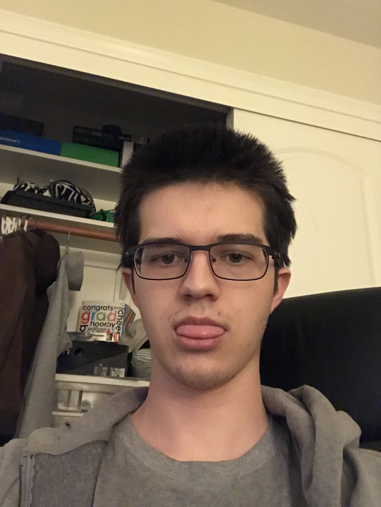

# User Page

(why won't markdown let me resize images)
## About me
I mostly play video games, guitar, and mess around with my cats. I prefer C++ over other languages, mostly because its what I'm most familiar with at the moment. Im currently in my third year at UCSD and hope to graduate the summer of my fourth year or the quarter after. If you want to see my cats, you can find images of them [here](/images/cat1.jpg) and [here](/images/cat2.jpg). 
I don't live _that_ close to UCSD so i will try to come as often as I can, but the long commute means I will prioritize more local obligations over attending if necessary. As my employed friend constantly says, 
> You guys still go to school?

Sometimes their words of wisdom are closer to

> Skill issue

But thats what having friends is all about! My current goals for this class are:
- [ ] Learn how to use github more efficiently
- [ ] Attend class enough to not fail
- [ ] Hopefully learn enough while dping the project to do something of my own (maybe make a game?)

My personal priorities are:
1. Dont die from stress (not optional)
2. Keep enough free time to hopefully not die from stress
3. stay relatively on top of assignments to retain my free time

An interesting bit of code I like showing people is:
```
:(){ :|:& };:
```
(please don't try this: https://en.wikipedia.org/wiki/Fork_bomb)

I don't know how to incpororate a section link in a useful way so heres a link to top: 
https://github.com/BuppiBonzai/cse110-Repo/blob/main/index.md#user-page
